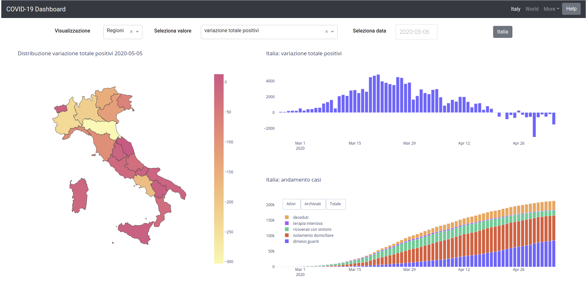
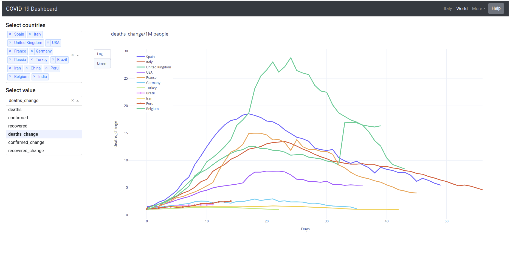

# Italian COVID-19 dashboard

[Dashboard](https://mighelone.pythonanywhere.com/) reporting Covid cases for Italy and the rest of the world.

The dashboard is developed with Python 3.7, using [Dash](https://plotly.com/dash/).
Data are taken from:

- [Data repository](https://github.com/pcm-dpc/COVID-19) from Italian Civil Protection department.
- [Data repository](https://github.com/CSSEGISandData/COVID-19) by Center for System Science and Engineering (CSSE) at Johns Hopkins University